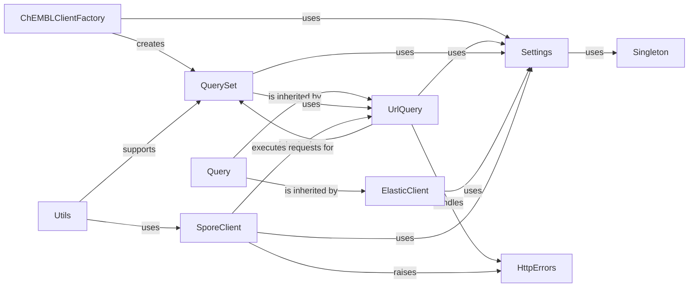

## Details

This overview details the core components of the ChEMBL Core API Client, focusing on their structure, flow, and purpose. These components are fundamental to how the client interacts with the ChEMBL REST API, from initiating requests to handling responses and errors.

### ChEMBLClientFactory

This component serves as the primary entry point for users to obtain and configure instances of the ChEMBL API client. It orchestrates the creation of client objects that expose a high-level, chainable interface for API interactions. It's fundamental because it's the user's gateway to the entire client functionality.

**Related Classes/Methods**:

- `ChEMBLClientFactory` (0:0)

### Query

A foundational abstract class that defines the basic structure and behavior for constructing and managing API queries. It acts as a base for more specialized query types, ensuring a consistent interface for query building across the client. It's fundamental as it establishes the common contract for all query operations.

**Related Classes/Methods**:

- <a href="https://github.com/chembl/chembl_webresource_client/chembl_webresource_client/query.py#L7-L35" target="_blank" rel="noopener noreferrer">`Query` (7:35)</a>

### UrlQuery

A specialized query handler that extends the capabilities of `Query` and `QuerySet`. It is specifically designed to construct and execute queries tailored for URL-based interactions with the REST API, managing aspects like URL parameters, filtering, and pagination. It's fundamental for handling the specifics of RESTful API queries.

**Related Classes/Methods**:

- <a href="https://github.com/chembl/chembl_webresource_client/chembl_webresource_client/url_query.py#L19-L444" target="_blank" rel="noopener noreferrer">`UrlQuery` (19:444)</a>

### QuerySet

A core component that provides mechanisms for managing collections of query results and enabling the chaining of multiple query operations. It facilitates complex data retrieval patterns by allowing queries to be combined, filtered, and iterated over efficiently. It's fundamental for handling and manipulating API responses as collections.

**Related Classes/Methods**:

- <a href="https://github.com/chembl/chembl_webresource_client/chembl_webresource_client/query_set.py#L21-L265" target="_blank" rel="noopener noreferrer">`QuerySet` (21:265)</a>

### ElasticClient

The primary client interface for performing search operations against the ChEMBL web resource. It provides high-level methods for searching various entities (e.g., molecules, targets, assays) and encapsulates the logic for executing these searches. Its inheritance from `Query` suggests it also offers direct query-building capabilities. It's fundamental for the core search functionality of the ChEMBL API.

**Related Classes/Methods**:

- <a href="https://github.com/chembl/chembl_webresource_client/chembl_webresource_client/elastic_client.py#L5-L47" target="_blank" rel="noopener noreferrer">`ElasticClient` (5:47)</a>

### Settings

A centralized component responsible for managing global settings and configurations for the entire ChEMBL web resource client. This includes critical parameters such as API endpoints, default timeouts, and other configurable options, ensuring consistent behavior across all client components. It's fundamental for maintaining consistent and configurable client behavior.

**Related Classes/Methods**:

- <a href="https://github.com/chembl/chembl_webresource_client/chembl_webresource_client/settings.py#L10-L41" target="_blank" rel="noopener noreferrer">`Settings` (10:41)</a>

### SporeClient

This component is responsible for the low-level execution of HTTP requests, handling the direct communication with the ChEMBL REST API. It likely wraps an underlying HTTP library to manage connections, send requests, and receive responses. It's fundamental as it's the actual communication layer with the ChEMBL API.

**Related Classes/Methods**:

- <a href="https://github.com/chembl/chembl_webresource_client/chembl_webresource_client/spore_client.py#L0-L0" target="_blank" rel="noopener noreferrer">`SporeClient` (0:0)</a>

### Singleton

A utility component that provides a mechanism to ensure that specific classes or objects within the client have only one instance throughout the application's lifecycle. This is crucial for managing shared resources like configurations or core client instances, preventing inconsistencies. It's fundamental for managing shared resources efficiently.

**Related Classes/Methods**:

- <a href="https://github.com/chembl/chembl_webresource_client/chembl_webresource_client/singleton.py#L2-L42" target="_blank" rel="noopener noreferrer">`Singleton` (2:42)</a>

### HttpErrors

Defines a set of custom exception classes for various HTTP error codes. This component provides a structured and specific way to handle and propagate errors encountered during API interactions, enhancing the client's robustness and error reporting. It's fundamental for robust error handling and clear communication of API issues.

**Related Classes/Methods**:

- <a href="https://github.com/chembl/chembl_webresource_client/chembl_webresource_client/http_errors.py#L0-L0" target="_blank" rel="noopener noreferrer">`HttpErrors` (0:0)</a>

### Utils

A collection of general utility functions that support various operations across the client. This component includes helper functions for data manipulation, API response processing, and other common functionalities that are essential for the overall operation of the client. It's fundamental as it provides common helper functions used throughout the client.

**Related Classes/Methods**:

- <a href="https://github.com/chembl/chembl_webresource_client/chembl_webresource_client/utils.py#L0-L0" target="_blank" rel="noopener noreferrer">`Utils` (0:0)</a>

### [FAQ](https://github.com/CodeBoarding/GeneratedOnBoardings/tree/main?tab=readme-ov-file#faq)