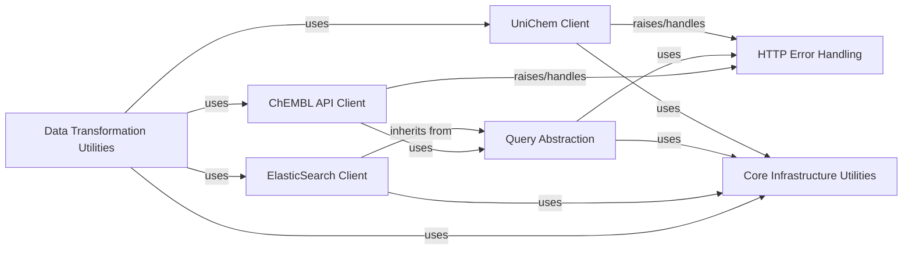

## Details

The `Data Transformation Utilities` component is a critical part of the `chembl_webresource_client` project, serving as the backbone for data manipulation, identifier resolution, and various transformations related to ChEMBL data. It is fundamental because it encapsulates the core logic required by the command-line scripts to interact with and process chemical and biological data from the ChEMBL database and related services.

### Data Transformation Utilities [[Expand]](./Data_Transformation_Utilities.md)

This component provides the core logic for data manipulation, identifier resolution, and various transformations of ChEMBL data, along with the command-line interfaces to execute these operations. It includes serializers for different data formats (e.g., SMILES, InChI, ChEMBL IDs) and functions for converting between molecules and targets.

**Related Classes/Methods**:

- <a href="https://github.com/chembl/chembl_webresource_client/chembl_webresource_client/scripts/utils.py#L1-L1" target="_blank" rel="noopener noreferrer">`chembl_webresource_client.scripts.utils` (1:1)</a>

- <a href="https://github.com/chembl/chembl_webresource_client/chembl_webresource_client/scripts/chembl_act.py#L1-L1" target="_blank" rel="noopener noreferrer">`chembl_webresource_client.scripts.chembl_act` (1:1)</a>

- <a href="https://github.com/chembl/chembl_webresource_client/chembl_webresource_client/scripts/chembl_ids.py#L1-L1" target="_blank" rel="noopener noreferrer">`chembl_webresource_client.scripts.chembl_ids` (1:1)</a>

- <a href="https://github.com/chembl/chembl_webresource_client/chembl_webresource_client/scripts/chembl_m2t.py#L1-L1" target="_blank" rel="noopener noreferrer">`chembl_webresource_client.scripts.chembl_m2t` (1:1)</a>

- <a href="https://github.com/chembl/chembl_webresource_client/chembl_webresource_client/scripts/chembl_sim.py#L1-L1" target="_blank" rel="noopener noreferrer">`chembl_webresource_client.scripts.chembl_sim` (1:1)</a>

- <a href="https://github.com/chembl/chembl_webresource_client/chembl_webresource_client/scripts/chembl_sub.py#L1-L1" target="_blank" rel="noopener noreferrer">`chembl_webresource_client.scripts.chembl_sub` (1:1)</a>

- <a href="https://github.com/chembl/chembl_webresource_client/chembl_webresource_client/scripts/chembl_t2m.py#L1-L1" target="_blank" rel="noopener noreferrer">`chembl_webresource_client.scripts.chembl_t2m` (1:1)</a>

### ChEMBL API Client

This component serves as the primary interface for interacting with the ChEMBL web API. It handles making HTTP requests, parsing responses, and providing a higher-level, structured interface to access ChEMBL data programmatically.

**Related Classes/Methods**:

- <a href="https://github.com/chembl/chembl_webresource_client/chembl_webresource_client/new_client.py#L1-L1" target="_blank" rel="noopener noreferrer">`chembl_webresource_client.new_client` (1:1)</a>

### ElasticSearch Client

This component provides a direct interface for querying the underlying ChEMBL data store, which is likely an Elasticsearch instance. It offers methods to search for specific chemical and biological entities, abstracting the complexities of the search engine.

**Related Classes/Methods**:

- <a href="https://github.com/chembl/chembl_webresource_client/chembl_webresource_client/elastic_client.py#L1-L1" target="_blank" rel="noopener noreferrer">`chembl_webresource_client.elastic_client` (1:1)</a>

### Query Abstraction

These are foundational base classes that provide an abstract framework for constructing and managing queries and query results. They define the basic interface for a query and functionalities for handling collections of query results or chaining queries, often integrating with HTTP error handling.

**Related Classes/Methods**:

- <a href="https://github.com/chembl/chembl_webresource_client/chembl_webresource_client/query.py#L1-L1" target="_blank" rel="noopener noreferrer">`chembl_webresource_client.query` (1:1)</a>

- <a href="https://github.com/chembl/chembl_webresource_client/chembl_webresource_client/query_set.py#L1-L1" target="_blank" rel="noopener noreferrer">`chembl_webresource_client.query_set` (1:1)</a>

- <a href="https://github.com/chembl/chembl_webresource_client/chembl_webresource_client/url_query.py#L1-L1" target="_blank" rel="noopener noreferrer">`chembl_webresource_client.url_query` (1:1)</a>

### Core Infrastructure Utilities

This component provides fundamental, low-level utilities and configurations essential for the entire client. It includes settings management, singleton patterns for shared resources, and a client for the Spore API, which might be used for API discovery or interaction.

**Related Classes/Methods**:

- <a href="https://github.com/chembl/chembl_webresource_client/chembl_webresource_client/settings.py#L1-L1" target="_blank" rel="noopener noreferrer">`chembl_webresource_client.settings` (1:1)</a>

- <a href="https://github.com/chembl/chembl_webresource_client/chembl_webresource_client/singleton.py#L1-L1" target="_blank" rel="noopener noreferrer">`chembl_webresource_client.singleton` (1:1)</a>

- <a href="https://github.com/chembl/chembl_webresource_client/chembl_webresource_client/utils.py#L1-L1" target="_blank" rel="noopener noreferrer">`chembl_webresource_client.utils` (1:1)</a>

- <a href="https://github.com/chembl/chembl_webresource_client/chembl_webresource_client/spore_client.py#L1-L1" target="_blank" rel="noopener noreferrer">`chembl_webresource_client.spore_client` (1:1)</a>

### HTTP Error Handling

This module defines a hierarchy of custom exception classes for various HTTP error codes (e.g., 404 Not Found, 400 Bad Request). These exceptions are crucial for robust error management, allowing the client to gracefully handle issues related to HTTP communication with web services.

**Related Classes/Methods**:

- <a href="https://github.com/chembl/chembl_webresource_client/chembl_webresource_client/http_errors.py#L1-L1" target="_blank" rel="noopener noreferrer">`chembl_webresource_client.http_errors` (1:1)</a>

### UniChem Client

This specialized component is designed to interact with the UniChem web service, which provides cross-references between chemical structures and their identifiers across various public databases. It handles UniChem-specific API calls and error handling.

**Related Classes/Methods**:

- <a href="https://github.com/chembl/chembl_webresource_client/chembl_webresource_client/unichem.py#L1-L1" target="_blank" rel="noopener noreferrer">`chembl_webresource_client.unichem` (1:1)</a>

### [FAQ](https://github.com/CodeBoarding/GeneratedOnBoardings/tree/main?tab=readme-ov-file#faq)