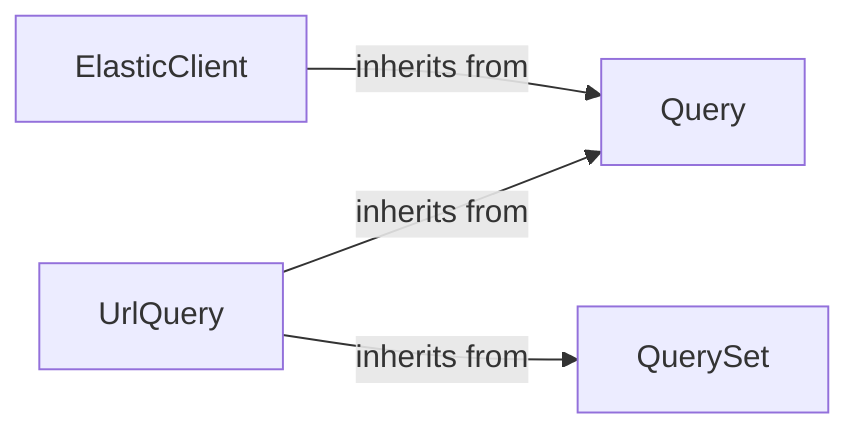

## Details

This subsystem provides a dedicated interface for performing searches across various ChEMBL entities (e.g., molecules, targets) leveraging an Elasticsearch backend. Its core functionality revolves around defining, executing, and managing search queries and their results.

### ElasticClient

The primary client interface for performing searches across various ChEMBL entities using an Elasticsearch backend. It provides high-level methods for searching molecules, targets, assays, etc., and internally orchestrates these search operations by utilizing its inherited `Query` capabilities and its internal `_search` method. It serves as the main entry point for Elasticsearch-based search operations.

**Related Classes/Methods**:

- <a href="https://github.com/chembl/chembl_webresource_client/chembl_webresource_client/elastic_client.py#L5-L47" target="_blank" rel="noopener noreferrer">`ElasticClient` (5:47)</a>

- <a href="https://github.com/chembl/chembl_webresource_client/chembl_webresource_client/elastic_client.py#L10-L29" target="_blank" rel="noopener noreferrer">`ElasticClient:_search` (10:29)</a>

### Query

A foundational abstract class that defines the basic structure and behavior for constructing and managing search queries. It establishes the common interface and basic parameters for any search request, serving as a base for more specialized query types.

**Related Classes/Methods**:

- <a href="https://github.com/chembl/chembl_webresource_client/chembl_webresource_client/query.py#L7-L35" target="_blank" rel="noopener noreferrer">`Query` (7:35)</a>

### UrlQuery

A specialized query handler that extends both `Query` and `QuerySet` functionalities. It is specifically designed to construct and execute queries for URL-based interactions with the ChEMBL web resource, handling aspects like pagination, filtering, and result iteration. This component bridges the gap between generic query definition and web-specific query execution.

**Related Classes/Methods**:

- <a href="https://github.com/chembl/chembl_webresource_client/chembl_webresource_client/url_query.py#L19-L444" target="_blank" rel="noopener noreferrer">`UrlQuery` (19:444)</a>

### QuerySet

A base class that provides mechanisms for managing collections of query results and enabling chained query operations. It allows for more complex data retrieval patterns by facilitating iteration over results and combining multiple query steps, crucial for handling paginated or large datasets from the web resource.

**Related Classes/Methods**:

- <a href="https://github.com/chembl/chembl_webresource_client/chembl_webresource_client/query_set.py#L21-L265" target="_blank" rel="noopener noreferrer">`QuerySet` (21:265)</a>

### [FAQ](https://github.com/CodeBoarding/GeneratedOnBoardings/tree/main?tab=readme-ov-file#faq)