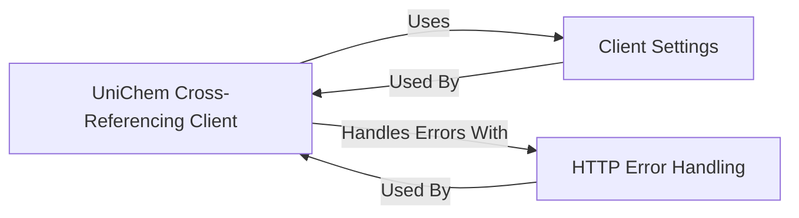

## Details

This document describes the UniChem Cross-Referencing Client and its fundamental components and their interactions. It covers the core client, configuration settings, and HTTP error handling, highlighting their roles in providing robust cross-referencing capabilities.

### UniChem Cross-Referencing Client [[Expand]](./UniChem_Cross_Referencing_Client.md)

The core of this subsystem, responsible for all interactions with the UniChem web service. It encapsulates the logic for making API calls, handling responses, and managing the HTTP session.

**Related Classes/Methods**:

- <a href="https://github.com/chembl/chembl_webresource_client/chembl_webresource_client/unichem.py#L1-L1" target="_blank" rel="noopener noreferrer">`chembl_webresource_client.unichem` (1:1)</a>

### Client Settings

Manages global configuration settings for the ChEMBL web resource client, including API URLs, timeouts, caching parameters, and proxy settings.

**Related Classes/Methods**:

- <a href="https://github.com/chembl/chembl_webresource_client/chembl_webresource_client/settings.py#L1-L1" target="_blank" rel="noopener noreferrer">`chembl_webresource_client.settings` (1:1)</a>

### HTTP Error Handling

Defines a hierarchy of custom exception classes for various HTTP error codes (e.g., HttpNotFound, HttpBadRequest).

**Related Classes/Methods**:

- <a href="https://github.com/chembl/chembl_webresource_client/chembl_webresource_client/http_errors.py#L1-L1" target="_blank" rel="noopener noreferrer">`chembl_webresource_client.http_errors` (1:1)</a>

### [FAQ](https://github.com/CodeBoarding/GeneratedOnBoardings/tree/main?tab=readme-ov-file#faq)