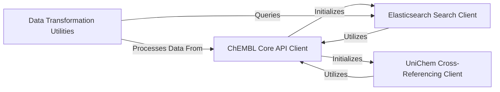

## Details

Final architecture analysis for `chembl_webresource_client`

### ChEMBL Core API Client [[Expand]](./ChEMBL_Core_API_Client.md)

This is the central component for interacting with the main ChEMBL REST API. It manages client instances, provides a high-level, chainable interface for building and executing queries, and handles the low-level HTTP request execution, including URL construction and pagination.

**Related Classes/Methods**:

- <a href="https://github.com/chembl/chembl_webresource_client/chembl_webresource_client/new_client.py#L0-L0" target="_blank" rel="noopener noreferrer">`chembl_webresource_client.new_client` (0:0)</a>

- <a href="https://github.com/chembl/chembl_webresource_client/chembl_webresource_client/spore_client.py#L0-L0" target="_blank" rel="noopener noreferrer">`chembl_webresource_client.spore_client` (0:0)</a>

- <a href="https://github.com/chembl/chembl_webresource_client/chembl_webresource_client/singleton.py#L0-L0" target="_blank" rel="noopener noreferrer">`chembl_webresource_client.singleton` (0:0)</a>

- <a href="https://github.com/chembl/chembl_webresource_client/chembl_webresource_client/settings.py#L0-L0" target="_blank" rel="noopener noreferrer">`chembl_webresource_client.settings` (0:0)</a>

- <a href="https://github.com/chembl/chembl_webresource_client/chembl_webresource_client/query_set.py#L0-L0" target="_blank" rel="noopener noreferrer">`chembl_webresource_client.query_set` (0:0)</a>

- <a href="https://github.com/chembl/chembl_webresource_client/chembl_webresource_client/url_query.py#L0-L0" target="_blank" rel="noopener noreferrer">`chembl_webresource_client.url_query` (0:0)</a>

- <a href="https://github.com/chembl/chembl_webresource_client/chembl_webresource_client/query.py#L0-L0" target="_blank" rel="noopener noreferrer">`chembl_webresource_client.query` (0:0)</a>

### Elasticsearch Search Client [[Expand]](./Elasticsearch_Search_Client.md)

This component provides a dedicated interface for performing searches across various ChEMBL entities (e.g., molecules, targets) leveraging an Elasticsearch backend.

**Related Classes/Methods**:

- <a href="https://github.com/chembl/chembl_webresource_client/chembl_webresource_client/elastic_client.py#L0-L0" target="_blank" rel="noopener noreferrer">`chembl_webresource_client.elastic_client` (0:0)</a>

### UniChem Cross-Referencing Client [[Expand]](./UniChem_Cross_Referencing_Client.md)

This component specializes in interacting with the UniChem web service, enabling cross-referencing of chemical identifiers from diverse external sources.

**Related Classes/Methods**:

- <a href="https://github.com/chembl/chembl_webresource_client/chembl_webresource_client/unichem.py#L0-L0" target="_blank" rel="noopener noreferrer">`chembl_webresource_client.unichem` (0:0)</a>

### Data Transformation Utilities [[Expand]](./Data_Transformation_Utilities.md)

This component comprises a collection of helper functions and scripts designed for data manipulation, resolution of identifiers, and various transformations related to ChEMBL data.

**Related Classes/Methods**:

- <a href="https://github.com/chembl/chembl_webresource_client/chembl_webresource_client/scripts/utils.py#L0-L0" target="_blank" rel="noopener noreferrer">`chembl_webresource_client.scripts.utils` (0:0)</a>

- <a href="https://github.com/chembl/chembl_webresource_client/chembl_webresource_client/scripts/chembl_act.py#L0-L0" target="_blank" rel="noopener noreferrer">`chembl_webresource_client.scripts.chembl_act` (0:0)</a>

- <a href="https://github.com/chembl/chembl_webresource_client/chembl_webresource_client/scripts/chembl_ids.py#L0-L0" target="_blank" rel="noopener noreferrer">`chembl_webresource_client.scripts.chembl_ids` (0:0)</a>

- <a href="https://github.com/chembl/chembl_webresource_client/chembl_webresource_client/scripts/chembl_m2t.py#L0-L0" target="_blank" rel="noopener noreferrer">`chembl_webresource_client.scripts.chembl_m2t` (0:0)</a>

- <a href="https://github.com/chembl/chembl_webresource_client/chembl_webresource_client/scripts/chembl_sim.py#L0-L0" target="_blank" rel="noopener noreferrer">`chembl_webresource_client.scripts.chembl_sim` (0:0)</a>

- <a href="https://github.com/chembl/chembl_webresource_client/chembl_webresource_client/scripts/chembl_sub.py#L0-L0" target="_blank" rel="noopener noreferrer">`chembl_webresource_client.scripts.chembl_sub` (0:0)</a>

- <a href="https://github.com/chembl/chembl_webresource_client/chembl_webresource_client/scripts/chembl_t2m.py#L0-L0" target="_blank" rel="noopener noreferrer">`chembl_webresource_client.scripts.chembl_t2m` (0:0)</a>

### [FAQ](https://github.com/CodeBoarding/GeneratedOnBoardings/tree/main?tab=readme-ov-file#faq)